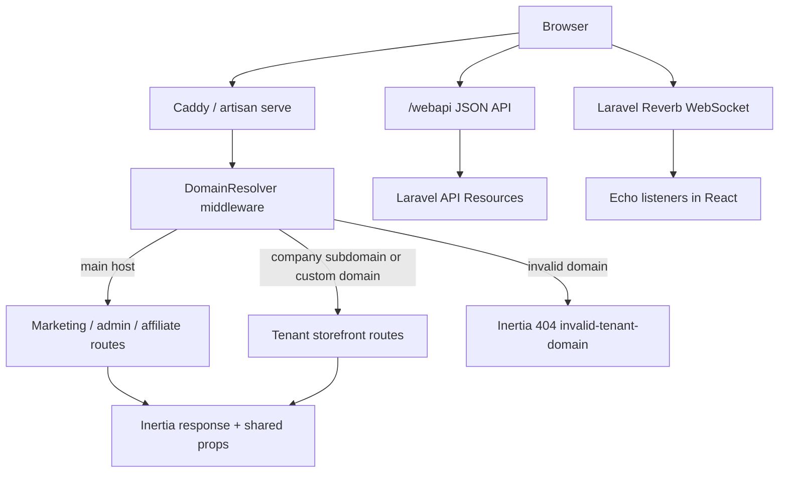

# Architecture Overview

Travelboost is a multi-tenant travel platform built as a **monolithic Laravel application** with an **Inertia + React** frontend. A single codebase serves the main marketing site, company landing pages (subdomains and custom domains), agent/vendor dashboards, affiliate panel, platform admin, and a session-based JSON API used by the React client.

For product-level requirements, see [Product Requirements](./requirements.md). For routing conventions, see [Routing](./routing.md).

---

## Technology Stack

### Backend

| Layer             | Technology                                                            |
| ----------------- | --------------------------------------------------------------------- |
| Runtime           | PHP 8.5 (`ext-bcmath` required for wallet/AI billing)                 |
| Framework         | Laravel 13                                                            |
| Database          | PostgreSQL 18 with **pgvector** (AI embeddings)                       |
| Auth              | Laravel Fortify (2FA, password reset) + Laratrust (roles/permissions) |
| Real-time         | Laravel Reverb + Laravel Echo                                         |
| AI                | Laravel AI (`laravel/ai`) via OpenRouter                              |
| Wallets           | Bavix Laravel Wallet (polymorphic user/company wallets)               |
| API docs          | Dedoc Scramble (OpenAPI from `/webapi` controllers)                   |
| API client (FE)   | Orval → TanStack Query hooks + TS types in `resources/js/api/`        |
| Web server (prod) | Caddy with on-demand TLS                                              |
| Debugging (dev)   | Laravel Telescope, Laravel Pail                                       |

### Frontend

| Layer                | Technology                                           |
| -------------------- | ---------------------------------------------------- |
| UI                   | React 19 + TypeScript                                |
| Server-driven pages  | Inertia.js v2                                        |
| Styling              | Tailwind CSS v4, shadcn/ui (Radix primitives)        |
| HTTP (Inertia)       | Inertia router + Wayfinder-generated route helpers   |
| HTTP (JSON API)      | Axios + TanStack React Query (Orval-generated hooks) |
| Real-time            | `@laravel/echo-react`                                |
| Client state         | Zustand, React Hook Form + Zod                       |
| Landing page builder | Puck editor (JSON stored in DB)                      |
| i18n                 | react-intl + FormatJS extraction                     |
| Build                | Vite 7                                               |

---

## High-Level Request Flow



Every web request passes through `DomainResolver` (`app/Http/Middleware/DomainResolver.php`), which sets tenant context before controllers run. Inertia pages and `/webapi` endpoints share the same Laravel session and CSRF stack.

---

## Repository Layout

### `app/` — backend domain

| Path                                    | Responsibility                                                 |
| --------------------------------------- | -------------------------------------------------------------- |
| `Http/Controllers/Admin/`               | Platform superadmin panel                                      |
| `Http/Controllers/Affiliate/`           | Affiliate network dashboard                                    |
| `Http/Controllers/Companies/Dashboard/` | Agent and vendor B2B dashboards                                |
| `Http/Controllers/Customers/`           | Tenant customer auth                                           |
| `Http/Controllers/Tenant/`              | Public tour catalog on company domains                         |
| `Http/Controllers/Webapi/`              | JSON API for React client (payments, tours, geo, etc.)         |
| `Http/Controllers/Webhooks/`            | Midtrans, PrismaLink payment callbacks                         |
| `Http/Middleware/`                      | Tenancy, scoped Inertia props, subscription checks             |
| `Http/Resources/`                       | API serializers consumed by Scramble/Orval                     |
| `Actions/Booking/`                      | Focused booking workflows (reserve, expire, finalize payment)  |
| `Services/`                             | Payment gateways, pricing, knowledge base, document generation |
| `Ai/Agents/`                            | AI agents (e.g. conversational assistant with pgvector RAG)    |
| `Models/`                               | Eloquent models (~64)                                          |
| `Events/` + `Listeners/`                | Domain events (auto-discovered by Laravel)                     |
| `Jobs/`                                 | Scheduled/queued background work                               |
| `Enums/`                                | Typed constants (`CompanyType`, `BookingStatus`, etc.)         |
| `Providers/`                            | Fortify, Midtrans, Telescope service providers                 |

See [Web API & Orval](./webapi-orval.md) for Scramble + Orval workflow (`pnpm orval` after Web API changes).

### `resources/js/` — frontend

| Path                   | Responsibility                                                                                             |
| ---------------------- | ---------------------------------------------------------------------------------------------------------- |
| `pages/`               | Inertia page components, grouped by audience (`admin/`, `companies/`, `affiliate/`, `me/`, `tours/`, etc.) |
| `components/`          | Shared UI, layouts, booking wizards                                                                        |
| `components/layouts/`  | Shell layouts per panel (`tenant-layout/`, `company-dashboard/`, `admin-dashboard/`, …)                    |
| `api/`                 | Orval-generated React Query client + TypeScript models                                                     |
| `routes/` + `actions/` | Wayfinder-generated type-safe Laravel route helpers                                                        |
| `stores/`              | Zustand client state                                                                                       |
| `app.tsx` / `ssr.tsx`  | Vite entry points                                                                                          |

### `routes/` — composed in `routes/web.php`

| File            | Scope                                                                |
| --------------- | -------------------------------------------------------------------- |
| `common.php`    | Main site pages, auth, bookings, webhooks, Caddy domain verification |
| `customers.php` | Tenant subdomain routes (`{username}.APP_HOST`) and customer auth    |
| `companies.php` | Company login/register and `/companies/{company}/dashboard/*`        |
| `admin.php`     | Platform admin at `/admin/*` (main domain only)                      |
| `affiliate.php` | Affiliate panel                                                      |
| `me.php`        | Authenticated user profile, onboarding, cross-tenant bookings        |
| `webapi.php`    | Session-based JSON API at `/webapi/*`                                |
| `channels.php`  | Reverb broadcast channel authorization                               |
| `console.php`   | Scheduler definitions                                                |

Bootstrap configuration lives in `bootstrap/app.php` (middleware aliases, routing, CSRF exceptions for webhooks).

### `database/`

- Base schema in `database/migrations/0001_01_01_000000_create_base_tables.php`
- Environment-specific seeders under `database/seeders/Local/`, `Development/`, `Production/`
- Shared seed data in `database/seeders/Common/` (roles, AppConfig, sample companies/tours)
- Factories for Pest feature tests
- ER diagrams and table reference: [Database Design](./database-design.md)

---

## Multi-Tenancy

Travelboost uses **host-based tenancy**, not separate databases or schemas per tenant.

### Domain resolution

`DomainResolver` compares `request()->getHost()` against `APP_HOST`:

| Host pattern           | Context                                                 |
| ---------------------- | ------------------------------------------------------- |
| `APP_HOST` (main)      | No tenant — marketing site, admin, company portal entry |
| `affiliate.APP_HOST`   | Affiliate internal subdomain (no company tenant)        |
| `{subdomain}.APP_HOST` | Lookup `domains.subdomain` → owner                      |
| Custom domain          | Lookup `domains.domain` → owner                         |

The `domains` table uses a polymorphic `owner` (`Company` or `AffiliateProfile`). Each record has `subdomain_enabled` and `domain_enabled` flags. Disabled or unknown domains render `pages/errors/invalid-tenant-domain`.

Resolved context is stored in Laravel `Context` and request attributes:

- `Context::add('domain', $domain)`
- `Context::add('tenant', $company)` for company-owned domains
- `Context::add('affiliate', $profile)` for affiliate-owned domains

`HomeDispatcherController` routes `/` to the correct homepage (main site vs affiliate vs tenant landing page).

### Customer data scoping

Customers belong to a company via `users.company_id`. The same email can register with multiple agents because uniqueness is scoped to `[company_id, email]` (see [Product Requirements](./requirements.md)).

Tenant storefront URLs use `Route::domain('{username}.'.$appHost)` in `routes/customers.php`. The `{username}` must match the resolved tenant company's username.

### TLS for custom domains

`CaddyController` exposes `/caddy/verify-domain` for Caddy on-demand TLS. Custom domain certificates are issued automatically by Caddy — no separate certbot step is required.

---

## Authentication and Authorization

### Identity model

All human actors are `User` records (`app/Models/User.php`) with:

- **Laratrust** roles and permissions
- **Fortify** for login, registration, 2FA, password reset
- **Bavix wallet** (optional balance per user)
- Team membership via `company_teams` pivot

### Global identity roles

Defined in `config/travelboost.php`, seeded by `RolePermissionSeeder`:

| Role             | Purpose                              |
| ---------------- | ------------------------------------ |
| `user:admin`     | Platform superadmin                  |
| `user:agent`     | Agent company staff login            |
| `user:vendor`    | Vendor company staff login           |
| `user:customer`  | End-customer on tenant landing pages |
| `user:affiliate` | Affiliate network member             |

Fortify login flows validate role intent (`login-as-admin`, `login-as-agent`, etc.) in `FortifyServiceProvider`.

### Company types

`CompanyType` enum: **`agent`** | **`vendor`**.

- **Agents** resell vendor tours, manage customers, subscriptions, commissions, and landing pages.
- **Vendors** publish tours, schedules, pricing, and seat availability.

Affiliates are a separate entity (`AffiliateProfile`), not a company type.

### Company-scoped authorization

Each company gets Laratrust roles like `company:{id}:superadmin` on creation. Permissions (`tour.query`, `wallet.mutation`, etc.) are defined in `config/travelboost.php`.

Team roles (`CompanyTeamRole`: superadmin, admin, operator, viewer) control dashboard access within a company.

### Gates and middleware

Gates in `AppServiceProvider`:

- `access-from-main-domain` — admin routes
- `access-customer-pages` — tenant domain must belong to a company
- `access-company-pages` — company portal routes

Additional middleware:

- `use-current-company-props` — shares company context to Inertia on dashboard routes
- `use-customer-props` / `set-and-use-anonymous-user-props` — tenant storefront props
- `agent.subscription.active` — blocks agent features when subscription expired

### Anonymous visitors

Guest browsing on tenant pages uses `AnonymousUser` records via `POST /webapi/anonymous-users/setup`.

---

## Business Domains

### Tours and catalog

- Vendors manage tours, schedules, prices, add-ons, and seat availability under `Companies/Dashboard/Tour*`.
- Agents browse vendor catalogs and configure resale rules (`VendorTourCatalogController`, commission tiers, product categories).
- Public catalog on tenant domains: `Tenant/TourController`.
- Landing page content is Puck JSON stored per company and rendered on the tenant homepage.

### Bookings

End-to-end flow from reservation hold → payment → confirmation → documents:

| Layer       | Key paths                                                                                |
| ----------- | ---------------------------------------------------------------------------------------- |
| Controllers | `BookingController`, `Companies/Dashboard/DashboardBookingController`                    |
| Actions     | `Actions/Booking/` (reserve, expire holds, finalize payment, settle commissions)         |
| Services    | `BookingPricingService`, `BookingPaymentWorkflowService`, `BookingTravelDocumentService` |
| Models      | `Booking`, `BookingRoom`, `BookingPassenger`, `BookingDocument`, `BookingActionRequest`  |
| Frontend    | `resources/js/pages/tours/bookings/create.tsx`, `companies/dashboard/bookings/`          |

Scheduled tasks expire unpaid reservations and send deadline reminders (`routes/console.php`).

### Payments and wallets

| Concern             | Implementation                                                                     |
| ------------------- | ---------------------------------------------------------------------------------- |
| Online payments     | Midtrans (`MidtransService`, webhook controller)                                   |
| Alternative gateway | PrismaLink (`PrismaLinkService`, callback + webhook)                               |
| Manual payments     | `BookingPaymentWorkflowService` with review/approval flow                          |
| Wallets             | Bavix — polymorphic wallets on `User` and `Company`                                |
| Withdrawals         | Company/affiliate/admin withdrawal controllers + auto-withdrawal job               |
| Top-ups             | Agent subscription, wallet top-up, AI credit top-up via `Webapi/PaymentController` |

Payment status sync runs via webhooks and a scheduled `MarkExpiredPaymentsJob`.

Local webhook testing uses [Cloudflare Tunnel](./cloudflare-tunnel.md) (`tunnel-8000.travelboost.co.id`).

### Affiliate network

Affiliates have their own domain, wallet, commission history, and referral tracking. Routes live in `routes/affiliate.php`. Separate from agent/vendor company dashboards.

### Platform admin

`/admin/*` on the main domain — user/company/vendor/agent management, tour orders, payments, withdrawals, AppConfig editor, AI usage logs.

---

## Frontend Architecture

### Inertia pages (server-rendered SPA)

Controllers return `Inertia::render('path/to/page', $props)`. Pages live under `resources/js/pages/` and mirror route audiences:

```
pages/
├── admin/              # Platform admin
├── affiliate/          # Affiliate dashboard
├── companies/
│   ├── dashboard/      # Agent/vendor B2B modules
│   └── templates/      # Tenant landing page themes
├── customers/          # Tenant customer auth
├── me/                 # User profile and onboarding
├── tours/              # Booking wizard
├── home/               # Main marketing site
└── errors/             # Domain and access errors
```

Each panel uses a dedicated layout from `resources/js/components/layouts/`.

### Shared Inertia props

`HandleInertiaRequests` shares global props: auth user, permissions, roles, flash messages, WhatsApp CS number from AppConfig.

Scoped props are injected by dedicated middleware rather than loading everything globally:

- `UseCurrentCompanyProps` — active company on dashboard routes
- `UseCustomerProps` — tenant company on storefront
- `UseAffiliateProps` — affiliate context
- `UseAnalyticsMeasurementIdsProps` — GA4 measurement IDs

### JSON API client (Orval)

Interactive UI features that need JSON outside Inertia (payments, geo lookups, etc.) call `/webapi`. Types and React Query hooks are generated via Scramble + Orval — see [Web API & Orval](./webapi-orval.md).

### Wayfinder (Inertia navigation)

Laravel Wayfinder generates `resources/js/routes/` and `resources/js/actions/` for type-safe links and form actions in Inertia pages. Separate from the Orval webapi client.

### Real-time UI

Laravel Echo + Reverb for websocket broadcasts (`@laravel/echo-react`).

---

## API Layer (`/webapi`)

Session-authenticated JSON API — not a token-based public REST API. Uses `web` middleware (cookies + CSRF).

| Access                | Endpoints (examples)                                                  |
| --------------------- | --------------------------------------------------------------------- |
| Authenticated         | companies, payments, withdrawals, wallets, bank accounts, medias, geo |
| Public / partial auth | tours, chat rooms/messages, anonymous user setup, payment creation    |

Controllers return `Http/Resources/*` classes. Scramble documents them at `/docs/api`.

Admin-only search helpers live under `/webapi/admin/misc/*`.

---

## Events, Queues, and Scheduling

Laravel auto-discovers event listeners from type-hinted `handle()` methods.

| Event                | Listener                                        | Notes                                       |
| -------------------- | ----------------------------------------------- | ------------------------------------------- |
| `ChatMessageCreated` | `ChatbotAutoReply`, `UpdateChatRoomLastMessage` | Dispatched by `ChatMessage` model on create |
| `MediaCreated`       | `CreateMediaKnowledgeBase`                      | Queued — embeds documents for chatbot RAG   |
| `MediaDeleting`      | `DeleteMediaReferences`                         | Queued                                      |
| `CompanyTeamCreated` | `SendTeamInvitationNotification`                |                                             |
| `TourCreated`        | `SendTourCreatedNotification`                   |                                             |

Background jobs: `SyncTourAvailabilityJob`, `MarkExpiredPaymentsJob`, `ProcessAutoWithdrawalJob`.

Scheduler (`routes/console.php`):

- Every minute — expire booking holds, mark expired payments
- Daily — agent subscription expiry, booking deadline reminders

Local dev runs queue + Reverb via `pnpm dev:full`.

---

## Data Layer

Full entity-relationship diagrams grouped by domain: [Database Design](./database-design.md).

### PostgreSQL features

- Standard relational schema for tours, bookings, companies, payments, chat
- **pgvector** column on `knowledge_bases.embedding` (1536 dimensions) for semantic search
- JSONB on `app_configs.value`, booking/tour metadata fields
- Enhanced PostgreSQL features via `tpetry/laravel-postgresql-enhanced`

### Key polymorphic relationships

| Morph         | Examples                           |
| ------------- | ---------------------------------- |
| Wallet holder | `User`, `Company`                  |
| Domain owner  | `Company`, `AffiliateProfile`      |
| Chat sender   | `User`, `Company`, `AnonymousUser` |
| Media owner   | Tours, knowledge base documents    |

### Migrations and seeders

Environment chosen in `DatabaseSeeder` (`local`, `development`, `production`). Common seeders always run: roles/permissions, AppConfig defaults, reference data.

---

## Configuration

### Static config files

| File                           | Contents                                                      |
| ------------------------------ | ------------------------------------------------------------- |
| `config/travelboost.php`       | Roles, permissions, company defaults, subscription check time |
| `config/midtrans.php`          | Payment gateway credentials                                   |
| `config/openrouter-models.php` | Allowed AI model lists                                        |
| `config/wallet.php`            | Bavix wallet settings                                         |
| `config/scramble.php`          | OpenAPI export path and docs URL                              |

### Runtime config (`AppConfig` model)

Admin-editable JSON settings with JSON Schema validation, stored in `app_configs`:

| Key       | Used for                                                      |
| --------- | ------------------------------------------------------------- |
| `chatbot` | AI model selection, token costs, per-interaction billing      |
| `admin`   | Platform fees, commission tiers, free AI credits, WhatsApp CS |
| `common`  | Site-wide settings including default GA measurement ID        |

Changes to `chatbot` invalidate the config cache used by AI agents.

### Feature flags (Pennant)

`laravel/pennant` is installed with a `features` table migration. Feature flag usage in application code is minimal today — infrastructure is ready for gradual rollouts.

---

## Third-Party Integrations

| Service            | Package / path                               | Purpose                             |
| ------------------ | -------------------------------------------- | ----------------------------------- |
| Midtrans           | `midtrans/midtrans-php`, `MidtransService`   | Online payments (VA, etc.)          |
| PrismaLink         | `PrismaLinkService`                          | Alternative payment gateway         |
| OpenRouter         | `laravel/ai`, `config/openrouter-models.php` | LLM + embeddings                    |
| Google Analytics   | `google/analytics-*`, dashboard OAuth        | Per-company GA4 reports             |
| Google OAuth       | `laravel/socialite`                          | GA account connection               |
| Bavix Wallet       | `bavix/laravel-wallet`                       | User/company balances               |
| Laratrust          | `santigarcor/laratrust`                      | RBAC                                |
| Laravolt Indonesia | `laravolt/indonesia`                         | Province/city/district/village data |
| DomPDF             | `barryvdh/laravel-dompdf`                    | Booking invoices / PDFs             |
| Maatwebsite Excel  | Report exports from dashboards               |
| Caddy              | `CaddyController`, production server         | Reverse proxy + on-demand TLS       |
| Intervention Image | `AppServiceProvider` ImageManager            | Media processing                    |

---

## Testing

- **Pest v4** with `pestphp/pest-plugin-laravel`
- `tests/Pest.php` — all tests use `RefreshDatabase`; base `TestCase` seeds `RolePermissionSeeder`
- ~40 test files across Feature (bookings, payments, wallets, auth, admin, affiliate) and Unit (Midtrans mocks, config helpers)
- Run: `php artisan test --compact` or filter with `--filter=TestName`

---

## Development vs Production

Local stack: [Local Development](./local-development.md) (`pnpm dev:full`). Production servers, Caddy, and Supervisor: [Production App Server](./production-app-server.md). Release workflow: [Deployment](./deployment.md).

---

## Related docs

Full index: [README](../README.md)

| Topic                       | Document                                                                                                                 |
| --------------------------- | ------------------------------------------------------------------------------------------------------------------------ |
| Configuration & env presets | [configuration.md](./configuration.md)                                                                                   |
| External integrations       | [integrations.md](./integrations.md)                                                                                     |
| Web API & Orval             | [webapi-orval.md](./webapi-orval.md)                                                                                     |
| Routing                     | [routing.md](./routing.md)                                                                                               |
| Product requirements        | [requirements.md](./requirements.md)                                                                                     |
| Development flow            | [development-flow.md](./development-flow.md)                                                                             |
| Team SOP                    | [team-sop.md](./team-sop.md)                                                                                             |
| Merge conflicts             | [merging-branch-conflicts.md](./merging-branch-conflicts.md)                                                             |
| Local development           | [local-development.md](./local-development.md)                                                                           |
| Cloudflare tunnel           | [cloudflare-tunnel.md](./cloudflare-tunnel.md)                                                                           |
| Testing email accounts      | [testing-email-accounts.md](./testing-email-accounts.md)                                                                 |
| Server inventory            | [server-inventory.md](./server-inventory.md)                                                                             |
| Production servers          | [production-app-server.md](./production-app-server.md), [production-database-server.md](./production-database-server.md) |
| Database backups            | [database-backups.md](./database-backups.md)                                                                             |
| Object storage              | [object-storage.md](./object-storage.md)                                                                                 |
| Debugging                   | [debugging.md](./debugging.md)                                                                                           |
| Deployment                  | [deployment.md](./deployment.md)                                                                                         |
| Translations                | [i18n.md](./i18n.md)                                                                                                     |
