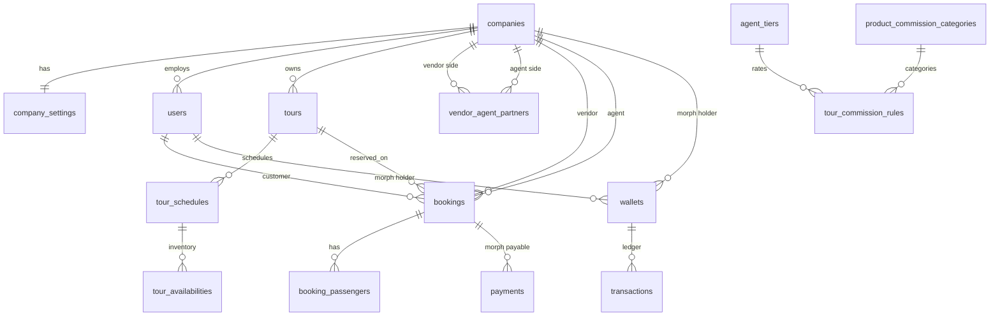
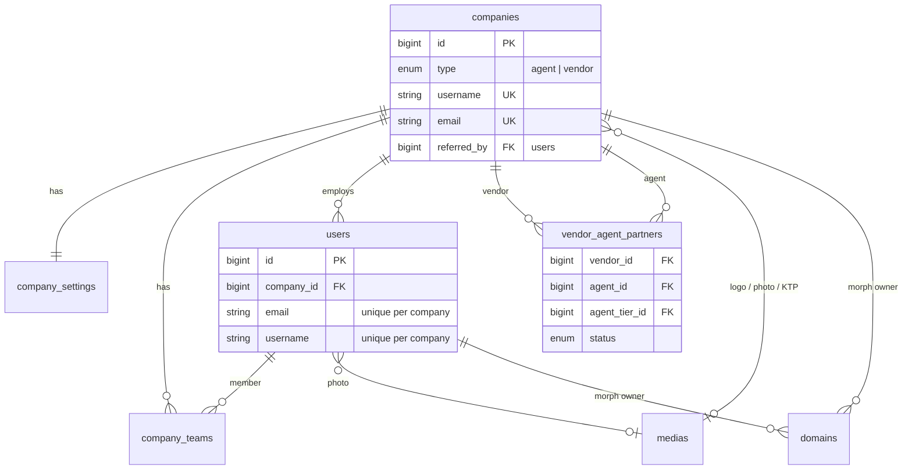
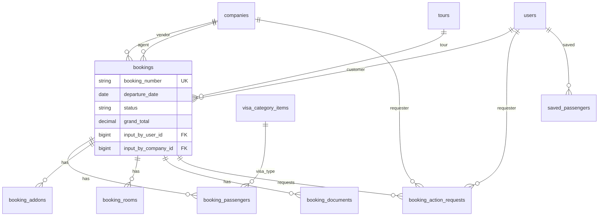
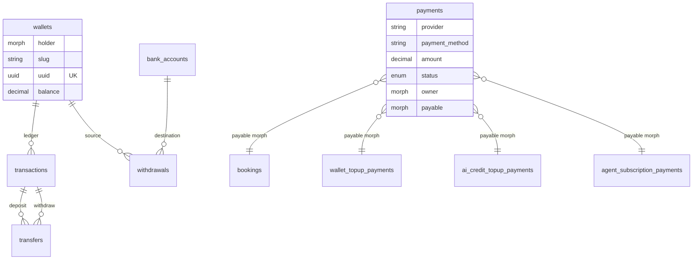
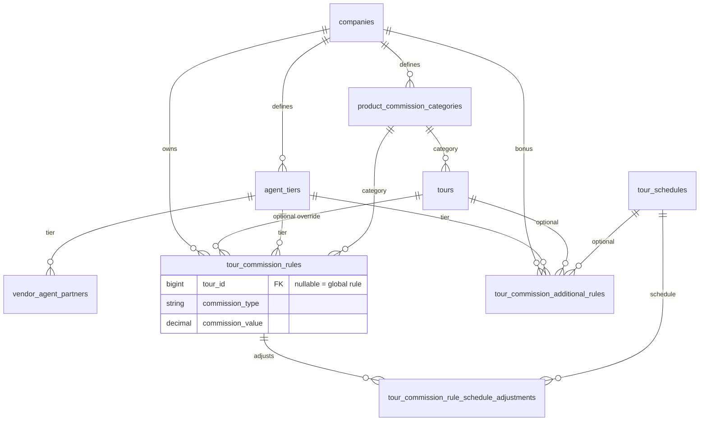
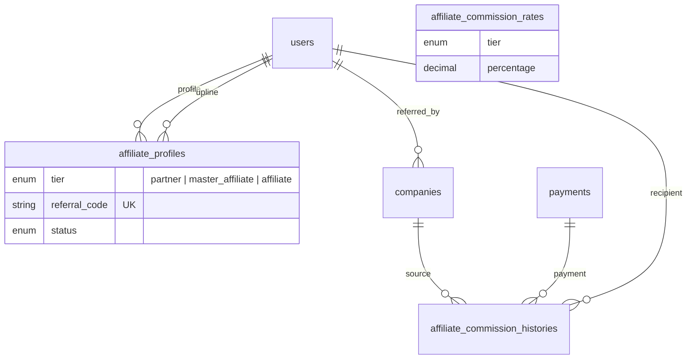
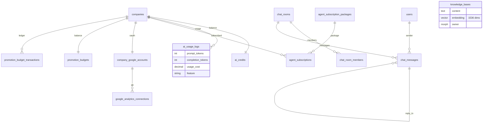
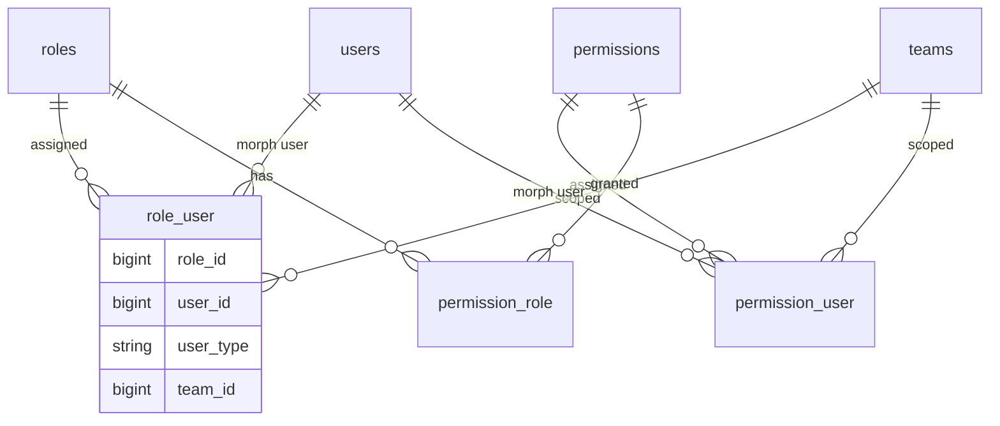

# Database Design

Entity-relationship overview of the Travelboost PostgreSQL schema. Diagrams are derived from Laravel migrations in `database/migrations/`.

For stack context and tenancy, see [Architecture](./architecture.md). For PostgreSQL server setup, see [Production Database Server](./production-database-server.md).

---

## Summary

| Metric             | Value                                                     |
| ------------------ | --------------------------------------------------------- |
| Engine             | PostgreSQL 18 with **pgvector**                           |
| Business domains   | 8 grouped areas below                                     |
| Application tables | ~66 (excluding Laravel/framework infra)                   |
| Source of truth    | `database/migrations/` + Eloquent models in `app/Models/` |

**Convention in diagrams:** arrows show foreign-key direction — parent (referenced table) → child (table holding the FK). Cardinality uses Mermaid `||--o{` (one-to-many) and `||--||` (one-to-one) notation.

---

## Domain overview

| Domain                                              | Tables | Purpose                                                         |
| --------------------------------------------------- | ------ | --------------------------------------------------------------- |
| [Identity & companies](#identity--companies)        | 8      | Multi-tenant agents/vendors, teams, settings, partnerships      |
| [Tours & catalog](#tours--catalog)                  | 14     | Product catalog, schedules, pricing, availability, visa options |
| [Bookings](#bookings)                               | 7      | Reservation lifecycle, passengers, documents, approvals         |
| [Payments & wallets](#payments--wallets)            | 10     | Midtrans payments, Bavix wallet ledger, withdrawals             |
| [Commission matrix](#commission-matrix)             | 6      | Vendor→agent tiered commission configuration                    |
| [Affiliate program](#affiliate-program)             | 4      | Referral network and payout history                             |
| [Chat, AI & subscriptions](#chat-ai--subscriptions) | 11     | Messaging, AI credits, subscriptions, Google Analytics          |
| [Auth & RBAC](#auth--rbac-laratrust)                | 6      | Laratrust roles, permissions, team scoping                      |

---

## High-level architecture

How the main business entities connect across domains:



---

## Identity & companies

Core tenancy: agent and vendor companies, staff users, team invites, branding media, and vendor–agent partnerships.



| Table                   | Key columns                             | Notes                                            |
| ----------------------- | --------------------------------------- | ------------------------------------------------ |
| `companies`             | `type`, `username`, `email`             | Root tenant entity (`agent` or `vendor`)         |
| `company_settings`      | `company_id` (unique)                   | Landing page JSON, payment terms, chatbot config |
| `company_teams`         | `company_id`, `user_id`, `invite_token` | Owner flag, pending invites                      |
| `users`                 | `company_id`, `email`, `username`       | Scoped uniqueness per company                    |
| `medias`                | `owner_type`, `owner_id`, `type`        | Polymorphic file metadata                        |
| `domains`               | `subdomain`, `domain`, `owner`          | Host-based tenancy resolution                    |
| `vendor_agent_partners` | `vendor_id`, `agent_id`                 | B2B partnership with status workflow             |
| `anonymous_users`       | `token`                                 | Guest chat participants                          |

---

## Tours & catalog

Vendor-owned tour products with schedules, per-departure pricing, seat counters, geography, and visa add-ons.

```mermaid
erDiagram
    companies ||--o{ tour_categories : owns
    companies ||--o{ tours : publishes
    tour_categories ||--o{ tours : categorizes
    continents ||--o{ regions : contains
    continents ||--o{ countries : contains
    regions ||--o{ countries : contains
    continents ||--o{ tours : destination
    regions ||--o{ tours : destination
    countries ||--o{ tours : destination
    companies ||--o{ visa_categories : defines
    visa_categories ||--o{ visa_category_items : items
    visa_categories ||--o{ tours : optional
    tours ||--o{ agent_tours : "resold by agent"
    companies ||--o{ agent_tours : agent
    tours ||--o{ tour_schedules : departures
    companies ||--o{ price_categories : defines
    tour_schedules ||--o{ tour_prices : priced
    price_categories ||--o{ tour_prices : tier
    tour_schedules ||--o{ tour_add_ons : extras
    tours ||--o{ tour_add_ons : extras
    tour_schedules ||--o{ tour_availabilities : seats
    tours ||--o{ tour_likes : liked
    users ||--o{ tour_likes : user

    tour_availabilities {
        int max_pax
        int RS WP DP FP
        int available
    }
```

| Table                 | Key columns                                    | Notes                               |
| --------------------- | ---------------------------------------------- | ----------------------------------- |
| `tours`               | `code`, `company_id`, `category_id`            | Unique `[code, company_id]`         |
| `tour_schedules`      | `departure_date`, `return_date`, `cutoff_date` | Per-departure instance              |
| `tour_prices`         | `schedule_id`, `price_category_id`             | Currency + commission fields        |
| `tour_availabilities` | `RS`, `WP`, `DP`, `FP`, `available`            | Seat status counters per schedule   |
| `price_categories`    | `room_type`                                    | e.g. twin, single                   |
| `visa_category_items` | `visa_category_id`, `price`, `is_taxable`      | Visa upsell line items              |
| `agent_tours`         | `company_id`, `tour_id`                        | Agent catalog mirror of vendor tour |

---

## Bookings

Reservation header linked to customer, vendor, agent, and tour; child tables hold passengers, rooms, add-ons, documents, and approval workflows.



| Table                     | Key columns                                     | Notes                           |
| ------------------------- | ----------------------------------------------- | ------------------------------- |
| `bookings`                | `booking_number`, `status`, `grand_total`       | Status via `BookingStatus` enum |
| `booking_passengers`      | `first_name`, `room_type`, `visa_type_snapshot` | Passport/visa file paths        |
| `booking_rooms`           | `room_type`, `occupancy`                        | Room allocation per booking     |
| `booking_action_requests` | `target_action`, `status`                       | Cancel/refund approval flow     |
| `saved_passengers`        | `user_id`                                       | Reusable passenger profiles     |

---

## Payments & wallets

Gateway payment records (polymorphic), Bavix wallet double-entry ledger, and withdrawal pipeline.



| Table             | Key columns                              | Notes                        |
| ----------------- | ---------------------------------------- | ---------------------------- |
| `payments`        | `provider`, `status`, `owner`, `payable` | Midtrans, PrismaLink, etc.   |
| `payment_methods` | `provider`, `method`, `category`         | Platform-wide method catalog |
| `wallets`         | `holder_type`, `holder_id`, `slug`       | Bavix Wallet on User/Company |
| `transactions`    | `wallet_id`, `type`, `amount`            | Deposit/withdraw entries     |
| `transfers`       | `deposit_id`, `withdraw_id`              | Wallet-to-wallet moves       |
| `bank_accounts`   | `owner`, `provider`, `status`            | Verified payout destinations |
| `withdrawals`     | `bank_account_id`, `amount`, `status`    | Manual or auto payout        |

---

## Commission matrix

Vendor-defined agent tiers and product commission categories drive per-tour and global commission rules.



| Table                                       | Key columns                    | Notes                                |
| ------------------------------------------- | ------------------------------ | ------------------------------------ |
| `agent_tiers`                               | `company_id`, `slug`           | e.g. Wholesaler, Seller Besar        |
| `product_commission_categories`             | `company_id`, `slug`           | e.g. Produk Umum, Promo              |
| `tour_commission_rules`                     | `tour_id` (nullable)           | Global matrix when `tour_id` is null |
| `tour_commission_rule_schedule_adjustments` | per schedule override          | Departure-specific rate              |
| `tour_commission_additional_rules`          | `scope_type`, `departure_date` | Bonus/special rules                  |

---

## Affiliate program

Separate referral network with tiered affiliates, rate config, and commission payout audit trail.



| Table                            | Key columns                          | Notes                        |
| -------------------------------- | ------------------------------------ | ---------------------------- |
| `affiliate_profiles`             | `tier`, `referral_code`, `upline_id` | Self-referential upline tree |
| `affiliate_commission_rates`     | `tier`, `percentage`                 | Platform-wide rate config    |
| `affiliate_commission_histories` | `payment_id`, `recipient_id`         | Immutable payout record      |
| `companies.referred_by`          | FK → `users`                         | Agent signup attribution     |

---

## Chat, AI & subscriptions

Real-time messaging, AI credit billing with usage logs, pgvector knowledge base, agent subscriptions, Google Analytics integration, Meta Pixel integration, and promotion budget with gated Google/Meta ads. See [Paid Ads & Promotion Budget](./google-ads-marketing.md).



| Table                             | Key columns                | Notes                           |
| --------------------------------- | -------------------------- | ------------------------------- |
| `chat_rooms`                      | `type`, `last_message_id`  | Private or group                |
| `chat_room_members`               | `member` (morph)           | User, Company, or AnonymousUser |
| `chat_messages`                   | `is_bot`, `reply_to`       | Bot and threaded replies        |
| `knowledge_bases`                 | `embedding` (vector)       | RAG for chatbot                 |
| `ai_credits`                      | `balance`                  | Per-company AI wallet           |
| `promotion_budgets`               | `balance`                  | Per-company ad promotion wallet |
| `promotion_budget_transactions`   | `type`, `amount`           | Top-up / spend ledger           |
| `promotion_budget_topup_payments` | `amount`                   | Midtrans payable morph          |
| `agent_subscription_packages`     | `duration_months`, `price` | SaaS tiers for agents           |
| `company_google_accounts`         | `google_id`, tokens        | OAuth for GA setup              |

---

## Auth & RBAC (Laratrust)

Role-based access control with optional team scoping on role and permission assignments.



Global roles (`user:admin`, `user:agent`, `user:vendor`, `user:customer`, `user:affiliate`) are seeded in `RolePermissionSeeder`. See [Architecture — Authentication](./architecture.md#authentication-and-authorization).

---

## Polymorphic patterns

Recurring `*_type` / `*_id` columns across the schema:

| Column                     | Holder types                                                                        | Used for                  |
| -------------------------- | ----------------------------------------------------------------------------------- | ------------------------- |
| `payments.owner`           | `User`, `Company`                                                                   | Who initiated the payment |
| `payments.payable`         | `Booking`, `WalletTopupPayment`, `AiCreditTopupPayment`, `AgentSubscriptionPayment` | What is being paid for    |
| `wallets.holder`           | `User`, `Company`                                                                   | Bavix wallet owner        |
| `medias.owner`             | Various models                                                                      | File attachments          |
| `domains.owner`            | `Company`, `AffiliateProfile`                                                       | Tenant host mapping       |
| `bank_accounts.owner`      | `User`, `Company`                                                                   | Payout account owner      |
| `chat_room_members.member` | `User`, `Company`, `AnonymousUser`                                                  | Room membership           |
| `chat_messages.sender`     | `User`, `Company`, `AnonymousUser`                                                  | Message author            |
| `knowledge_bases.owner`    | Optional morph                                                                      | Scoped RAG content        |
| `notifications.notifiable` | `User`, etc.                                                                        | Laravel notifications     |

---

## Infrastructure & reference tables

These support the platform but sit outside the core business domains above:

| Table                                                | Package / purpose                            |
| ---------------------------------------------------- | -------------------------------------------- |
| `app_configs`                                        | Runtime JSON settings with schema validation |
| `features`                                           | Laravel Pennant feature flags                |
| `currencies`                                         | Reference currency codes                     |
| `notifications`                                      | Laravel database notifications               |
| `sessions`, `cache`, `jobs`, `failed_jobs`           | Laravel framework                            |
| `indonesia_provinces`, `indonesia_cities`, …         | Laravolt Indonesia geo data                  |
| `telescope_*`                                        | Laravel Telescope (dev)                      |
| `agent_conversations`, `agent_conversation_messages` | Laravel AI agent memory                      |

---

## Keeping this document current

1. After schema changes, update the relevant migration and Eloquent model.
2. Regenerate this doc's diagrams if table relationships change materially.
3. Inspect live schema: `php artisan db:show` or read `database/migrations/`.
4. Eloquent relationships: `app/Models/*.php`.
