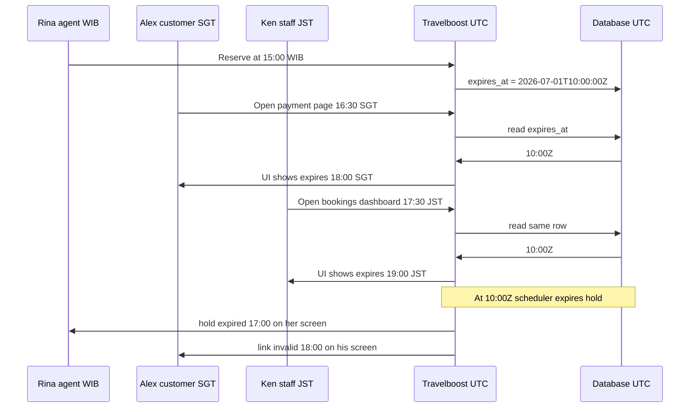

# Date & time (UTC + ISO 8601)

Avoid timezone bugs when the team works across WIB, travel, and UTC servers.

Doc index: [README](../README.md)

---

## Understand this first

An **instant** is one moment worldwide (when payment completed, when a hold expires).

A **calendar date** is a day on the calendar (tour departs **15 Aug 2026**) — not a moment in time.

|             | Instant                               | Calendar date                   |
| ----------- | ------------------------------------- | ------------------------------- |
| Examples    | `paid_at`, `expires_at`, `created_at` | `departure_date`, date of birth |
| In DB       | `timestamp` (UTC)                     | `date` or `YYYY-MM-DD`          |
| On the wire | ISO 8601 with `Z` or offset           | `YYYY-MM-DD` only               |

---

## The rule

1. **Servers use UTC** (`APP_TIMEZONE=UTC` in [`config/app.php`](../config/app.php)).
2. **API sends and receives ISO 8601** for instants — e.g. `2026-07-01T08:30:00Z`.
3. **Only the UI** converts to local time for display (dayjs, browser).

---

## Example: booking hold across timezones

Real scenario — three people, three timezones, **one** booking.

**Setup:** Agent **Rina** (Jakarta, WIB) reserves seats at **15:00** her time. The hold expires **2 hours** later. Customer **Alex** (Singapore, UTC+8) opens the payment link. Teammate **Ken** (Tokyo, JST) watches the booking list on the dashboard.

### What everyone sees (same hold, different clocks)

| Step                    | Rina Jakarta WIB          | Alex Singapore       | Ken Tokyo JST        | Database UTC            |
| ----------------------- | ------------------------- | -------------------- | -------------------- | ----------------------- |
| Hold created            | 1 Jul **15:00**           | 1 Jul **16:00**      | 1 Jul **17:00**      | `created_at` **08:00Z** |
| Hold expires            | 1 Jul **17:00**           | 1 Jul **18:00**      | 1 Jul **19:00**      | `expires_at` **10:00Z** |
| Scheduler releases seat | hold gone after 17:00 WIB | gone after 18:00 SGT | gone after 19:00 JST | job runs at **10:00Z**  |

Rina does **not** “save 17:00 WIB”. The server saves **`2026-07-01T10:00:00Z`**. Everyone’s UI converts that one instant to local time. When the clock hits that instant anywhere on Earth, the hold is expired for all of them.

### Who does what



### What goes wrong without UTC + ISO 8601

| Mistake                                     | Result                                                                                  |
| ------------------------------------------- | --------------------------------------------------------------------------------------- |
| Store `17:00` with no timezone              | Server in UTC thinks hold expires at 17:00 **UTC** — wrong by 7 hours for Jakarta users |
| Backend sends `"expires_at": "17:00 WIB"`   | Frontend in Singapore cannot parse reliably; translations and sorting break             |
| Alex’s browser sends local time without `Z` | Backend may save the wrong instant; Rina and Ken see different expiry times             |
| Developer adds `+7` in PHP “to fix WIB”     | Every other timezone drifts; jet-lag bugs in reports                                    |

**Correct:** one UTC instant in the DB, ISO 8601 in JSON, each browser shows local time. Compare instants in code with UTC — never with “what my wall clock said”.

---

## What is ISO 8601?

An international standard for writing **dates and times as text** so people and systems agree on the meaning.

**Problem it solves:** `01/07/2026` can be 1 July or 7 January. `2026-07-01 15:00` has no timezone — WIB, UTC, or your laptop?

ISO 8601 uses a **fixed layout** and puts the **timezone in the string**.

### Instant (date + time)

```text
2026-07-01T15:30:00+07:00
│          │ │        └── +7 hours from UTC (WIB)
│          │ └── 15:30:00
│          └── T separates date from time
└── YYYY-MM-DD
```

Same moment in UTC:

```text
2026-07-01T08:30:00Z    ← Z means UTC (zero offset)
```

`2026-07-01T08:30:00Z` and `2026-07-01T15:30:00+07:00` are the **same instant**.

### Date only (no time)

```text
2026-07-01
```

A **calendar day** — use for departure dates, not for `paid_at` or `expires_at`.

### Cheat sheet

| String                      | Meaning                                      |
| --------------------------- | -------------------------------------------- |
| `2026-07-01T08:30:00Z`      | 08:30 UTC                                    |
| `2026-07-01T15:30:00+07:00` | 15:30 WIB (= 08:30Z)                         |
| `2026-07-01`                | Date only                                    |
| `2026-07-01 15:00:00`       | **Not** valid for APIs — no `T`, no timezone |

### In this project

**Client sends:** `new Date().toISOString()`  
**Backend returns:** `$model->created_at?->toIso8601String()`  
**Client displays:** `dayjs(iso).format('...')` — browser converts to local time.

Do not add or subtract hours in PHP/TS between these steps. The `Z` or `+07:00` already defines the instant.

---

## Strong sign you do not understand it yet

If you need to **adjust time in application code** between client and database, stop.

| You are about to…                                                                                  | What it usually means                                                                      |
| -------------------------------------------------------------------------------------------------- | ------------------------------------------------------------------------------------------ |
| Fix a timestamp **from the client** before insert (`addHours`, “convert to WIB”, strip timezone)   | Client should send ISO 8601; backend should `Carbon::parse()` and save — **no adjustment** |
| Fix a value **from the DB** before sending to the client (`subHours`, format as local server time) | DB is already UTC; send ISO 8601 — **client** formats for display                          |
| Add `+7` / `-7` anywhere in PHP or TS for normal CRUD                                              | Wrong layer — learn ISO 8601 + UTC storage                                                 |

Correct flow has **no timezone math** in the middle:

```text
Client  --ISO 8601-->  Backend  --UTC-->  DB
Client  <--ISO 8601--  Backend  <--UTC--  DB
         (display converts locally)
```

Manual offsets mean the string on the wire was wrong, or `APP_TIMEZONE` is not UTC, or someone mixed up an instant with a calendar date.

---

## Backend

- `APP_TIMEZONE=UTC` on staging and production.
- Parse input: `Carbon::parse($iso8601String)` then save — do not reshape first.
- Output: `toIso8601String()` / `toISOString()` — do not reshape first.
- Calendar dates: `Y-m-d` / `date` columns — never run through UTC offset logic.

---

## Frontend

- **In:** parse ISO string from API.
- **Out:** `toISOString()` for instants; `YYYY-MM-DD` for date-only filters.
- **Show:** dayjs / `Intl` — local timezone is for the screen only.

---

## Exceptions (rare, explicit)

- **Scheduler** at “09:00 Jakarta” uses `scheduler_timezone` in [`config/travelboost.php`](../config/travelboost.php) — when cron runs, not how rows are stored.
- **Display metadata** (e.g. GA property timezone, manual hold timezone label) — not a substitute for UTC timestamps.

---

## Related

[Team SOP](./team-sop.md) · [Single source of truth](./single-source-of-truth.md) (backend owns timestamps)
