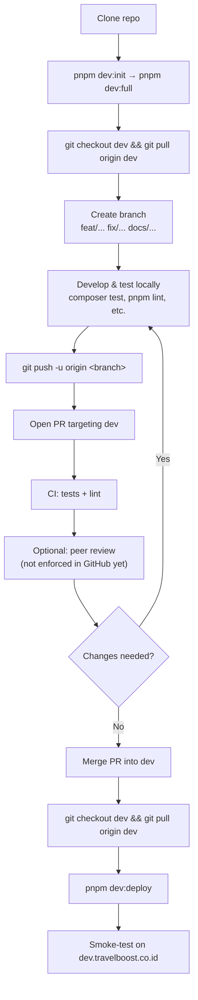
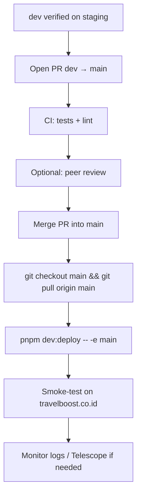
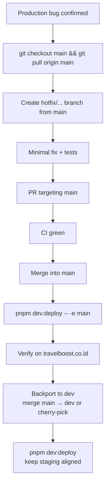
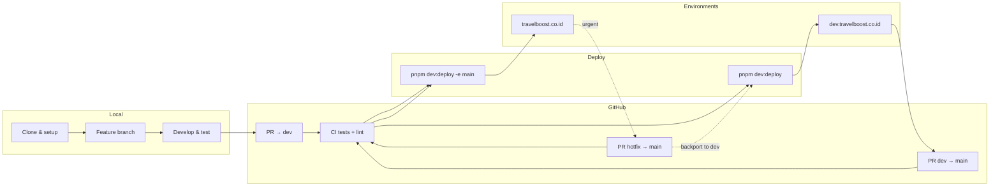

# Development Flow

End-to-end workflow from clone to deploy: feature work on `dev`, releases to production on `main`, and hotfixes.

Doc index: [README](../README.md) · Details: [Team SOP](./team-sop.md) · Deploy commands: [Deployment](./deployment.md)

---

## Branch model

| Branch | Environment | URL                   | Deploy preset |
| ------ | ----------- | --------------------- | ------------- |
| `dev`  | Staging     | dev.travelboost.co.id | `-e dev`      |
| `main` | Production  | travelboost.co.id     | `-e main`     |

**Rules**

- Never commit or push directly to `dev` or `main`.
- All work happens on short-lived branches (`feat/`, `fix/`, `docs/`, `hotfix/`, etc.).
- Merge into `dev` first for normal work; promote `dev` → `main` when staging is verified.

---

## Standard flow (feature / fix / docs)

Use this for everyday development.

### Step by step

| Step            | Action                                                                                                                                                       |
| --------------- | ------------------------------------------------------------------------------------------------------------------------------------------------------------ |
| 1. Clone        | `git clone <repository-url>` then `cd travelboost`                                                                                                           |
| 2. Local setup  | `pnpm dev:init` (deps + env preset), then `pnpm dev:full` — see [Local Development](./local-development.md)                                                  |
| 3. Sync `dev`   | `git checkout dev && git pull origin dev`                                                                                                                    |
| 4. Branch       | `git checkout -b feat/my-feature` (or `fix/`, `docs/`, `refactor/`, `chore/`)                                                                                |
| 5. Work         | Implement, run checks from [Team SOP — Before you push](./team-sop.md#before-you-push)                                                                       |
| 6. Push         | `git push -u origin feat/my-feature`                                                                                                                         |
| 7. Pull request | Open PR on GitHub **into `dev`** — include what/why, how to test, deploy notes                                                                               |
| 7b. Conflicts   | If `dev` moved ahead: [Merging Branch Conflicts](./merging-branch-conflicts.md)                                                                              |
| 8. CI           | GitHub Actions runs Pest tests and lint on PRs to `dev` and `main`                                                                                           |
| 9. Review       | Ask a teammate to review when possible. **Required approvals are not configured in GitHub yet** — merge when CI is green and you are confident in the change |
| 10. Merge       | Squash or merge PR into `dev` (team default: merge commit is fine)                                                                                           |
| 11. Deploy dev  | On your machine: `git checkout dev && git pull origin dev` then `pnpm dev:deploy`                                                                            |
| 12. Verify      | Test on [dev.travelboost.co.id](https://dev.travelboost.co.id)                                                                                               |

Deploy details and skip flags: [Deployment](./deployment.md).

---

## Production release flow

Promote tested work from staging to live.

### Step by step

| Step               | Action                                                                                           |
| ------------------ | ------------------------------------------------------------------------------------------------ |
| 1. Confirm staging | Features on `dev` are tested on dev.travelboost.co.id                                            |
| 2. Release PR      | Open PR **`dev` → `main`** (or merge via GitHub UI)                                              |
| 3. CI              | Wait for green checks                                                                            |
| 4. Merge           | Merge into `main` — coordinate with the team for production windows                              |
| 5. Deploy          | `git checkout main && git pull origin main` then `pnpm dev:deploy -- -e main`                    |
| 6. Verify          | Smoke-test critical paths on production; watch [Debugging](./debugging.md) logs if issues appear |

**Server:** `tb-app-main` (103.93.163.174) — [Server Inventory](./server-inventory.md).

Never run `migrate:fresh` on production. Migrations run automatically during deploy (`php artisan migrate --force`).

---

## Hotfix flow (urgent production fix)

For a bug on **live** that cannot wait for the normal `dev` → `main` cycle.

### Step by step

| Step                  | Action                                                                                                        |
| --------------------- | ------------------------------------------------------------------------------------------------------------- |
| 1. Branch from `main` | `git checkout main && git pull origin main` then `git checkout -b hotfix/wallet-timeout`                      |
| 2. Fix                | Smallest safe change; add or update tests                                                                     |
| 3. PR to `main`       | Open PR targeting **`main`** (not `dev`)                                                                      |
| 4. Merge              | Merge when CI passes — hotfix is the exception where self-merge may be acceptable if no reviewer is available |
| 5. Deploy production  | `git checkout main && git pull` then `pnpm dev:deploy -- -e main`                                             |
| 6. Backport           | Merge `main` into `dev` (or cherry-pick the hotfix commit) so staging matches production                      |
| 7. Deploy dev         | `pnpm dev:deploy` to update dev.travelboost.co.id                                                             |

**Do not** leave `dev` and `main` diverged after a hotfix — always backport.

---

## Overview (all paths)

---

## Quick reference

| Task                  | Branch from | PR target      | Deploy command                                                 |
| --------------------- | ----------- | -------------- | -------------------------------------------------------------- |
| New feature           | `dev`       | `dev`          | `pnpm dev:deploy`                                              |
| Bug fix (non-urgent)  | `dev`       | `dev`          | `pnpm dev:deploy`                                              |
| Release to production | —           | `dev` → `main` | `pnpm dev:deploy -- -e main`                                   |
| Hotfix (production)   | `main`      | `main`         | `pnpm dev:deploy -- -e main` then backport + `pnpm dev:deploy` |

### Pre-deploy checklist

1. Changes **pushed** to `origin` on the branch you deploy (`dev` or `main`)
2. **Clean** working tree (`git status`)
3. Local branch matches `DEPLOY_BRANCH` in the preset
4. PR notes mention new env vars, migrations, or manual steps

---

## Related docs

| Topic                                    | Doc                                                       |
| ---------------------------------------- | --------------------------------------------------------- |
| Branch naming, commits, coding standards | [Team SOP](./team-sop.md)                                 |
| Merge conflicts                          | [Merging Branch Conflicts](./merging-branch-conflicts.md) |
| Deploy script, flags, manual steps       | [Deployment](./deployment.md)                             |
| Server IPs and hostnames                 | [Server Inventory](./server-inventory.md)                 |
| Local setup                              | [Local Development](./local-development.md)               |
