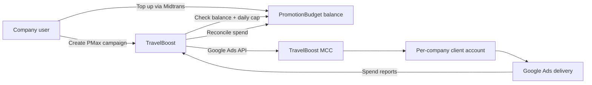
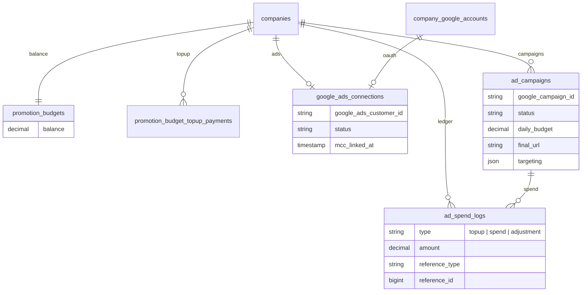

# Paid Ads & Promotion Budget

Let agent companies create **Google Performance Max** and **Meta traffic** campaigns from the dashboard, funded by a **TravelBoost promotion budget** (not personal ad platform billing).

**Status:** Backend implemented behind feature flags. **Google Ads and Meta Ads are not publicly enabled yet** (`MARKETING_GOOGLE_ADS_ENABLED=false`, `MARKETING_META_ADS_ENABLED=false` by default). Promotion budget top-up is available; ad platform connections and campaign creation show **Coming soon** in the UI until flags are turned on. TikTok ads are planned next.

Related docs: [Architecture](./architecture.md), [Product Requirements](./requirements.md), [Database Design](./database-design.md).

---

## Feature flags

| Env variable                   | Default | Effect                                                |
| ------------------------------ | ------- | ----------------------------------------------------- |
| `MARKETING_GOOGLE_ADS_ENABLED` | `false` | Google Ads OAuth, provisioning, campaigns, spend sync |
| `MARKETING_META_ADS_ENABLED`   | `false` | Meta Ads OAuth, provisioning, campaigns, spend sync   |

Central helper: `App\Support\MarketingFeatures`. Shared to the frontend as `marketingFeatures` via `UseCurrentCompanyProps`.

When both flags are `false`, the **Ad Campaigns** page shows a coming-soon state; **Promotion Budget** still allows top-up but lists Google/Meta/TikTok as coming soon.

---

## Problem statement

Agents want to promote tours and landing pages on Google without managing a separate Google Ads account, payment method, or API integration. TravelBoost should:

1. Accept top-ups into a company **promotion budget** (similar to AI credits).
2. Create and manage **Performance Max** campaigns via the Google Ads API.
3. Bill Google from a **platform-owned manager account (MCC)** and reconcile spend against each company's budget.
4. Pause or block campaigns when the budget is exhausted.

---

## What exists today

| Area                   | Status                           | Key files                                                                |
| ---------------------- | -------------------------------- | ------------------------------------------------------------------------ |
| Google OAuth (company) | GA + optional Ads scope          | `GoogleAccountController`, `CompanyGoogleAccount`                        |
| Google Analytics API   | Read insights + property linking | `GoogleAnalyticsService`, `GoogleAnalyticsController`                    |
| Meta Pixel analytics   | Read insights + pixel linking    | `MetaAnalyticsService`, `MetaAnalyticsController`                        |
| Promotion budget       | **Live** (top-up via Midtrans)   | `PromotionBudget`, `PromotionBudgetController`, `marketing/budget`       |
| Google Ads             | **Implemented, gated**           | `GoogleAdsService`, `google/connect-ads`, `MARKETING_GOOGLE_ADS_ENABLED` |
| Meta Ads               | **Implemented, gated**           | `MetaAdsService`, `facebook/connect-ads`, `MARKETING_META_ADS_ENABLED`   |
| Ad campaigns UI        | **Implemented, gated**           | `AdCampaignController`, `marketing/campaigns`                            |
| Spend sync             | **Implemented, gated**           | `SyncGoogleAdsSpendJob`, `SyncMetaAdsSpendJob` (hourly)                  |

### Google OAuth scopes today

`GoogleAccountController::connect` requests:

- `https://www.googleapis.com/auth/analytics.readonly`
- `https://www.googleapis.com/auth/analytics.edit`

These scopes **cannot** create ads. Google Ads requires a separate API, client library, and the `adwords` OAuth scope.

---

## Chosen approach: platform MCC + promotion budget

We evaluated billing the user's linked Google account directly. The recommended **hybrid** model uses a **TravelBoost-owned MCC** instead:



### Why platform MCC

| Approach                  | Pros                                                                                                            | Cons                                                                                     |
| ------------------------- | --------------------------------------------------------------------------------------------------------------- | ---------------------------------------------------------------------------------------- |
| **Platform MCC (chosen)** | True "our budget"; users don't need Google billing; enforceable balance; single TravelBoost invoice from Google | Requires MCC setup, developer token, Google approvals                                    |
| User's Google Ads account | Simpler Google setup                                                                                            | User pays Google directly; hard to enforce TravelBoost budget; worse UX for small agents |

### Role of the linked Google account

OAuth remains useful for **identity** and optional **asset access** (business name, images). It is **not** the billing source. Spend flows: user → TravelBoost (Midtrans) → Google (MCC).

---

## User flow (target)

1. Agent opens **Marketing → Promotion Budget** (subscription-gated like other marketing features).
2. Agent tops up promotion budget via Midtrans (same payment stack as AI credits / wallet top-up).
3. Agent connects Google (extended OAuth with `adwords` scope) or continues from an existing linked account.
4. On first ads setup, TravelBoost provisions a **client account** under the platform MCC for that company.
5. Agent completes a **Performance Max wizard**:
    - Final URL (landing page or tour page)
    - Daily budget in IDR (capped by remaining balance)
    - Geo targeting (Indonesia default)
    - Headlines, descriptions, 1–3 images
6. TravelBoost creates the campaign via Google Ads API.
7. A background job syncs spend; campaigns auto-pause when balance is low.

---

## Technical architecture

### New backend components

| Component                     | Responsibility                                                  |
| ----------------------------- | --------------------------------------------------------------- |
| `PromotionBudget` model       | Per-company spendable balance                                   |
| `PromotionBudgetTopupPayment` | Midtrans payable (mirror `AiCreditTopupPayment`)                |
| `AdSpendLog` / ledger         | Audit trail: top-ups, Google-reported spend, adjustments        |
| `GoogleAdsConnection`         | `google_ads_customer_id`, link status under MCC                 |
| `GoogleAdsService`            | MCC client provisioning, PMax create/pause, metrics, spend sync |
| `GoogleAdsController`         | Dashboard routes: budget, campaigns, create, pause              |
| `SyncGoogleAdsSpendJob`       | Scheduled reconciliation; pause on low balance                  |

### Patterns to reuse

| Existing pattern                               | Reuse for ads                                                          |
| ---------------------------------------------- | ---------------------------------------------------------------------- |
| `AiCredit` + `AiCreditTopupPayment`            | Promotion budget balance and top-up                                    |
| `PaymentController` + Midtrans settlement      | Payment creation and webhook handling                                  |
| `GoogleAnalyticsService`                       | Service class structure, OAuth token storage on `CompanyGoogleAccount` |
| `MetaAnalyticsService`                         | External API error handling, caching, dashboard deferred props         |
| `UseCurrentCompanyProps` `isMarketingDisabled` | Feature gate for agent subscription / free trial                       |

### Google Ads API (Performance Max)

Package to add: `googleads/google-ads-php`.

`GoogleAdsService` responsibilities:

- `ensureClientAccount(Company $company)` — create client under MCC if missing
- `createPerformanceMaxCampaign(...)` — `Campaign` (type `PERFORMANCE_MAX`), `CampaignBudget`, `AssetGroup`, assets
- `pauseCampaign()`, `getCampaignMetrics()`
- `syncSpend(Company $company)` — pull cost from Google, deduct from promotion budget

**MVP campaign inputs:**

| Field        | Source                                                        |
| ------------ | ------------------------------------------------------------- |
| Final URL    | Company landing page (`landing_page_data`) or tour tenant URL |
| Daily budget | User input, max = remaining promotion balance                 |
| Geo          | Indonesia default; optional company region later              |
| Copy         | Form fields; later AI-generated from tour descriptions        |
| Images       | Tour photos or upload                                         |

### OAuth changes

Extend `GoogleAccountController::connect` (or add a separate connect action):

- New scope: `https://www.googleapis.com/auth/adwords`
- Separate OAuth `intent`: `connect-google-ads` (keep `connect-analytics` independent)

Store on `CompanyGoogleAccount` or `GoogleAdsConnection`:

- `google_ads_customer_id`
- `mcc_linked_at`, `status`

### Frontend

| Page                      | Purpose                                      |
| ------------------------- | -------------------------------------------- |
| Promotion budget overview | Balance, top-up CTA, transaction history     |
| Campaign list             | Active/paused PMax campaigns + basic metrics |
| Create PMax wizard        | URL, budget, geo, copy, images               |
| Linked accounts           | Ads connection status alongside GA           |

Enable the commented nav item `marketings.budgeting` in `use-company-dashboard-nav-main-menu.tsx`.

Reuse tab/layout patterns from `resources/js/pages/companies/dashboard/analytics/`.

### Routes (planned)

Under `routes/companies.php`, alongside existing `analytics/*`:

- `marketing/budget` — balance and top-up
- `marketing/campaigns` — list
- `marketing/campaigns/create` — PMax wizard
- `google/connect-ads` — OAuth with adwords scope (or extend existing connect)

---

## Database (planned)

New tables (names may change during implementation):



See [Database Design](./database-design.md) for current schema; this section will be merged there when tables land.

---

## External prerequisites (start early)

These block production and are **outside the codebase**:

| Prerequisite                   | Notes                                                                             |
| ------------------------------ | --------------------------------------------------------------------------------- |
| Google Ads API developer token | Apply in Google Ads API Center. Basic for test accounts; Standard for real spend. |
| TravelBoost MCC account        | Manager account with billing configured.                                          |
| Meta Business Manager          | Business ID, system user token, Facebook Page for link ads.                       |
| OAuth consent screen           | Google `adwords` scope; Meta `ads_management` — may require app review.           |
| Landing page quality           | Final URLs must be HTTPS and policy-compliant for travel ads.                     |

### Environment variables

```env
# Feature flags (default: disabled)
MARKETING_GOOGLE_ADS_ENABLED=false
MARKETING_META_ADS_ENABLED=false

# Google Ads manager (platform billing)
GOOGLE_ADS_DEVELOPER_TOKEN=
GOOGLE_ADS_LOGIN_CUSTOMER_ID=
GOOGLE_ADS_REFRESH_TOKEN=

# Meta Ads manager (platform billing)
META_ADS_BUSINESS_ID=
META_ADS_ACCESS_TOKEN=
META_ADS_PAGE_ID=
```

---

## Phased rollout

| Phase                | Scope                                            | Status                           |
| -------------------- | ------------------------------------------------ | -------------------------------- |
| **1 — Budget**       | `PromotionBudget`, Midtrans top-up, dashboard UI | **Live**                         |
| **2 — Account link** | Google/Meta OAuth, platform provisioning         | **Implemented, feature-flagged** |
| **3 — Campaigns**    | Google PMax + Meta traffic create/pause          | **Implemented, feature-flagged** |
| **4 — Spend sync**   | Hourly reconciliation, auto-pause                | **Implemented, feature-flagged** |
| **5 — Launch**       | Enable flags after platform credentials + review | **Pending**                      |
| **6 — Polish**       | AI ad copy, charts, TikTok                       | Planned                          |

---

## Budget enforcement rules

1. **Creation guard** — reject campaign create if `daily_budget > promotion_budget.balance`.
2. **Daily cap** — campaign `CampaignBudget` amount ≤ platform-approved daily limit.
3. **Spend sync** — job pulls Google cost (micros), writes `ad_spend_logs`, decrements balance.
4. **Auto-pause** — when balance below threshold (e.g. one day of budget), pause all active campaigns.
5. **Idempotency** — spend logs keyed by Google report date + campaign ID to avoid double deduction.

---

## Feature gating

Marketing features are disabled when (`UseCurrentCompanyProps`):

- Agent is on a **free trial** package, or
- Agent **subscription is expired**

Google Ads follows the same gate as Analytics and the commented `marketings.budgeting` nav item.

---

## Testing strategy

Mirror `tests/Feature/GoogleAnalyticsConnectionTest.php`:

- OAuth scope and connection persistence (mock Socialite)
- Budget top-up settlement via Midtrans webhook (mock)
- Campaign creation blocked when balance insufficient
- `GoogleAdsService` unit tests with mocked API client (no live Google in CI)

---

## Risks and constraints

| Risk                                                   | Mitigation                                                                            |
| ------------------------------------------------------ | ------------------------------------------------------------------------------------- |
| Google approval latency                                | Start developer token + OAuth verification in Phase 1                                 |
| PMax asset minimums                                    | Validate headlines/images in form before API call; surface Google policy errors in UI |
| Currency mismatch (IDR wallet vs MCC billing currency) | Configure MCC for IDR where possible; document FX handling if not                     |
| Travel ad policy rejections                            | Show disapproval reasons from Google; link to policy docs                             |
| Analytics ≠ Ads API                                    | Do not extend `GoogleAnalyticsService`; use separate `GoogleAdsService` and package   |

---

## Key file reference

### Existing (analytics only)

| File                                                                   | Role                             |
| ---------------------------------------------------------------------- | -------------------------------- |
| `app/Http/Controllers/Companies/Dashboard/GoogleAccountController.php` | OAuth connect/disconnect         |
| `app/Http/Controllers/Google/GoogleAuthController.php`                 | OAuth callback                   |
| `app/Services/GoogleAnalyticsService.php`                              | GA4 Admin + Data API             |
| `app/Models/CompanyGoogleAccount.php`                                  | Stored OAuth tokens              |
| `app/Models/GoogleAnalyticsConnection.php`                             | Linked GA property               |
| `app/Models/AiCredit.php`                                              | **Pattern** for promotion budget |
| `app/Http/Controllers/Webapi/PaymentController.php`                    | **Pattern** for top-up payments  |

### Planned (to be created)

| File                                                               | Role                   |
| ------------------------------------------------------------------ | ---------------------- |
| `app/Models/PromotionBudget.php`                                   | Company balance        |
| `app/Models/GoogleAdsConnection.php`                               | Ads customer under MCC |
| `app/Models/AdCampaign.php`                                        | Local campaign record  |
| `app/Services/GoogleAdsService.php`                                | Google Ads API client  |
| `app/Http/Controllers/Companies/Dashboard/GoogleAdsController.php` | Dashboard HTTP         |
| `app/Jobs/SyncGoogleAdsSpendJob.php`                               | Spend reconciliation   |
| `resources/js/pages/companies/dashboard/marketing/`                | Budget + campaign UI   |

---

## FAQ

**Can we use the existing Google Analytics link to create ads?**  
No. Different API, scopes, and billing model. Analytics linking stays as-is; ads adds parallel connection data and a new service.

**Will users need their own Google Ads billing?**  
No, in the chosen MCC model. TravelBoost pays Google; users top up promotion budget via Midtrans.

**Why Performance Max first?**  
Automated bidding and placement across Google surfaces with a simpler campaign structure than Search-only or Display setups. Good fit for promoting tour landing pages.

**How is this different from tour `promote_price`?**  
`promote_price` on tours is an in-catalog discount. Promotion budget is **paid advertising spend** on Google.
