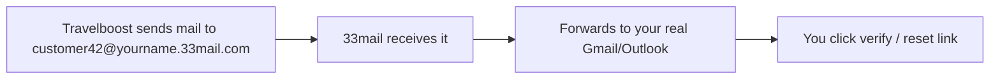

# Testing Accounts with Bulk Real Email

How to create many unique test accounts that can receive real emails (verification links, password resets, booking notifications) without maintaining dozens of inboxes.

Doc index: [README](../README.md) · Related: [Local Development](./local-development.md) · [Team SOP](./team-sop.md)

---

## When you need this

Travelboost enforces **unique email addresses** per user (`unique:users,email`). Several flows also send **real outbound mail**:

- Customer registration and email verification
- Affiliate registration and verification
- Password reset links
- Booking and payment notifications (on dev/staging when mail is not `log`)

Local development usually sets `MAIL_MAILER=log`, so messages only appear in `storage/logs/laravel.log`. On **dev/staging servers** (or when testing with real SMTP), you need addresses that:

1. Are **unique** in the database (cannot reuse `test@example.com` for every signup)
2. **Accept delivery** from the app (not blocked as fake/invalid)
3. Land in an inbox you can actually open to click verification or reset links

Creating a new Gmail account for every test is slow. **33mail** solves this with unlimited forwarding aliases to one real inbox.

---

## What is 33mail?

[33mail](https://33mail.com/) is a **mail forwarder** service. You register once with your real email (Gmail, Outlook, etc.). 33mail gives you a personal subdomain:

```text
you@yourname.33mail.com   ← pattern for every alias
```

Any address of the form `anything@yourname.33mail.com` is valid. You do **not** pre-create aliases — 33mail creates them automatically the first time mail is sent to that address, then **forwards** it to your real inbox.

### How it works



1. **Sign up** at [33mail.com](https://33mail.com/) and choose a username (e.g. `travelboostqa` → `@travelboostqa.33mail.com`).
2. **Confirm** your real forwarding address via the email 33mail sends you.
3. **Use any alias** when registering on Travelboost — invent it on the spot; no setup step required.
4. **Receive** all messages in your normal inbox. Reply-from-alias is supported on paid tiers; for testing, clicking links in forwarded mail is usually enough.
5. **Block** an alias from the 33mail email controls if a site spams that address.

### Why it counts as a “real” email

- Each alias is a distinct RFC-valid address (satisfies `email` validation and DB uniqueness).
- Mail is delivered over normal SMTP to 33mail, then forwarded — verification and reset links work.
- Unlike `+tag` tricks (`user+test1@gmail.com`), some third-party gateways treat 33mail aliases as separate recipients, which helps when testing payment or OAuth flows that key on email.

---

## Recommended naming for Travelboost QA

Use predictable aliases so you can tell which test is which in your inbox:

| Purpose            | Example alias                                         |
| ------------------ | ----------------------------------------------------- |
| Customer signup    | `tb-customer-001@travelboostqa.33mail.com`            |
| Second customer    | `tb-customer-002@travelboostqa.33mail.com`            |
| Affiliate signup   | `tb-affiliate-001@travelboostqa.33mail.com`           |
| Agent staff user   | `tb-agent-staff-001@travelboostqa.33mail.com`         |
| Feature under test | `tb-booking-hold-2026-07-01@travelboostqa.33mail.com` |

Replace `travelboostqa` with your 33mail username.

Tips:

- **One alias per test account** — reusing an alias for a new signup fails if that email already exists in `users`.
- **Include context in the local part** — makes inbox search easier (`tb-booking-hold`, `tb-wallet-topup`).
- **Note the alias in your PR** under “How to test” so reviewers know which inbox to check.

---

## Example: register many customers on dev

1. Open the dev tenant site (e.g. agent subdomain on `tb-app-dev`).
2. Register with `tb-customer-001@yourname.33mail.com`.
3. Check your real inbox (or spam) for the verification email forwarded by 33mail.
4. Click the link and complete onboarding.
5. Repeat with `tb-customer-002@...`, `tb-customer-003@...`, etc.

For affiliate flows, use the affiliate registration URL and `tb-affiliate-*` aliases the same way.

---

## Deliverability tips

Forwarded mail sometimes lands in spam, especially on free tiers.

- Add **`sender@mailer1.33mail.com`** to your contacts (33mail FAQ recommendation).
- Create an inbox filter: never send mail from `*@33mail.com` to spam.
- If verification mail does not arrive within a few minutes, check Telescope (local) or server logs (dev) to confirm the app sent it, then check spam.

---

## Limits and caveats

| Topic     | Notes                                                                                                             |
| --------- | ----------------------------------------------------------------------------------------------------------------- |
| Free tier | Generous for QA; monthly bandwidth cap (~500 emails/month on free — see [33mail FAQ](https://33mail.com/faq)).    |
| Premium   | Custom domain, higher limits, anonymous reply — optional for heavy QA.                                            |
| Privacy   | Aliases forward to your real address; do not use for production customer data.                                    |
| Cleanup   | Block unused aliases in 33mail; delete test users in admin or DB when done.                                       |
| Local dev | With `MAIL_MAILER=log`, read `storage/logs/laravel.log` instead — 33mail is for environments that send real mail. |

---

## Alternatives

- **Gmail `+` addressing** (`you+tb001@gmail.com`) — one inbox, but some sites normalize or reject plus-tags; 33mail aliases are fully separate addresses.
- **Mailtrap / Mailhog** — good for catching outbound mail in dev, but not for end-to-end “click the link in a real inbox” tests on shared staging.
- **Team shared inbox** — one address reused breaks `unique:users,email` unless you delete the user between tests.

For bulk manual QA on dev/staging, **33mail is the recommended approach**.
